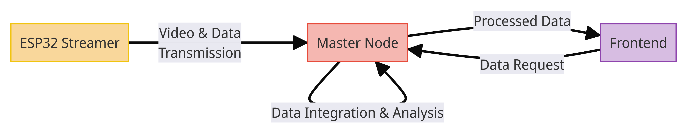

## Contents
1. [Introduction](#introduction)
2. [How to follow this docs](#how-to-follow-this-docs)
3. [System Architecture](#system-architecture)
4. [How to Setup](#how-to-setup)
5. [System Architecture](#system-architecture)
6. [Troubleshooting](#troubleshooting)
7. [Things Left to Do](#things-left-to-do)
8. [Thanks](#thanks)

## Introduction

Are you a beekeeper? Do you struggle to keep control of your beehives and would like insights on what's going on, and possible actions to take, from your smartphone or laptop? Then our system is designed for you!

HiveGuard aims to improve beekeeping by leveraging modern technology to give beekeepers an edge in managing and monitoring their hives. This includes real-time video streaming, environmental sensing, machine learning for bee behavior analysis, and instant alerts - all integrated into an easy-to-use platform.

## How to follow this docs

You will find a general overview of the system here, and linked you will find the software and documentation for every component. We recommend you read this docs first, and then read the docs for the [Master Server](https://github.com/pablotrrs/hive-guard-master-server/blob/main/README.md), then the docs for the [Streamer](https://github.com/FrancoBre/hive-guard-streamer/blob/main/README.md), and finally the docs for the [Frontend](https://github.com/EvolutionRX/hive-guard-client/blob/main/README.md).

## System Architecture

The system is composed of three major components: 

1. *Streamer*: An ESP32CAM along with a DHT11 module attached to a hive for recording video, temperature, and humidity. Attach the streamer to your hive. It records video, temperature, and humidity, and streams this data to the master server over a local network.

  

  

2. *Master Server*: A central server that processes data from the streamer. The master server uses machine learning to detect and analyze bee behaviors such as entering/leaving the hive and identifying ill bees. This server is intended to be run in a computer on the field where the hives are in, or in a raspberry pi. Its results are sent to the frontend.

4. *Frontend*: A user interface that displays processed data and insights. The frontend generates charts and summaries, helping you make informed decisions such as when to place a pollen trap or identify potential hive issues. Alerts are sent to your email and displayed on the frontend.

## How to Set Up

### Prerequisites
- **Hardware**: ESP32-CAM modules for streamers, DHT11 sensors for temperature and humidity, a computer or Raspberry Pi for the master server.
- **Software**: All software and detailed setup instructions are available as open source. You can find the Git projects as submodules of this repository.

You can try the system using the mocks available in the master server to showcase some functionalities before deploying it to your hives.

To try the system on your hives:
1. *Initialize Master Server*: Start the master server first.
2. *Streamer Initialization*: Power on the ESP32CAM. It will launch an AP for WiFi credentials, connect to the network, and send a UDP broadcast message. The master server listens and starts a WebSocket connection.
3. *Save master server public URL*: The server's webpage (localhost:8000/client) displays bee images, temperature, humidity data, and both local and public IP addresses. Save the master server public URL.
4. *Frontend Connection*: A live version is available at this [link](https://hive-guard-client-production.up.railway.app/). If unavailable, follow the local setup instructions in the documentation. Enter the master server's public URL in the frontend. The frontend performs a health check and establishes a connection to display hive data. Then it will ask you for config params such as thresholds for the alerts.

## Troubleshooting

Having trouble? Here are some troubleshooting tips:

- *Firewall Issues*: If you encounter connectivity problems, ensure any firewalls on the master server's device are disabled.
- *Connectivity*: Make sure all devices are on the same network and properly configured.

## Things Left to Do

Here are our next steps:

### Further Testing

We are not beekepers, and the beekeper who is helping us is not a programmer, so this system needs further testing under real life scenarios. If you're a beekeper and a programmer, any feedback and contributions would be invaluable!

### Battery
We developed a version that allows battery-powered streamers and battery level monitoring from the streamers. The battery level is displayed by the master server on its webpage and also in the frontend. We even created alerts for when the battery level exceeds a threshold, similar to how we handle humidity and temperature alerts, both via email and live alerts in the frontend!

The problem is that we didn't have enough pins on the ESP32-CAM. We had to read a general-purpose pin on the ESP32-CAM only during startup. When the device starts, it reads from the pin; if there is voltage, it means battery level monitoring is enabled. We save the battery level, stream it, work normally for 10 minutes, and then reboot the device to read the battery level again.

This is problematic because the re-connection takes time, during which we might lose data.

So, we thought of adding an extra ESP8266 device to the ESP32-CAM to use its additional pins. We could also attach an infrared movement sensor to record actual bee movement and save battery.

You can find more information about this in the "Things Left to Do" section in the master server and streamer projects.
   
### Network Optimization
Batch data transmission from streamers to optimize bandwidth usage and avoid congestion.

## Thanks

We would like to express our deep gratitude to:

- *Jorge Seniw and his family*: For letting us try the system, and helping us out with beekeeping related questions and issues. You can find him in this instagram account: [La miel de papá](https://www.instagram.com/lamiel.depapa?igsh=MWZzeG85d3R0cXhpMQ==)
- *[Fabian Hickert](https://github.com/BeeAlarmed/BeeAlarmed)*: For his outstanding work on the machine learning neural network, which we used for detecting bees and identifying illnesses.
- *[Nomadic Geek](https://www.youtube.com/@nomadicgeek_369)*: For his foundational [surveillance system](https://www.youtube.com/watch?v=WsPFQx0p4Us&list=PLFRIWPt6uUoVsirzwwqrNtp5vG-4ByIoe) that inspired our project.
- *Prof. Alexis Tcach*: For his guidance and support throughout the development of HiveGuard.

---

Thank you for choosing HiveGuard! Whether you are a beekeeper, a programmer, or both, your contributions and feedback are invaluable. Feel free to fork, contribute, or contact us. Happy beekeeping!
